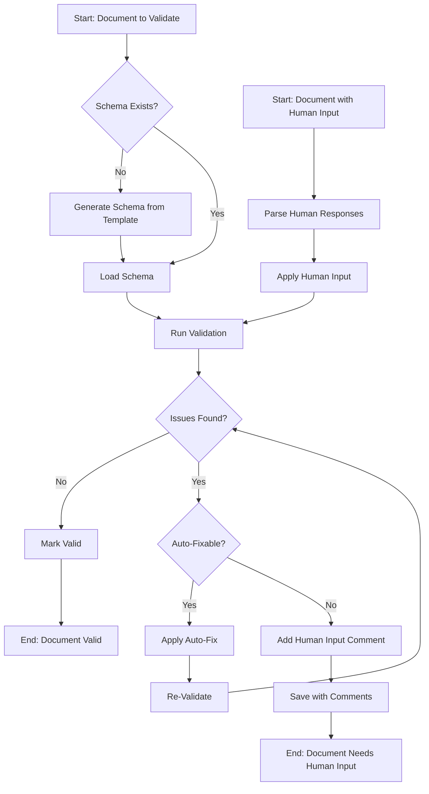

# **Workflow: Markdown Document Validation**

This workflow defines the step-by-step process for validating and fixing markdown documents, including schema discovery, validation execution, auto-fixing, and human input handling.

---

## **1. Workflow Overview**



---

## **2. Phase 1: Schema Discovery and Generation**

### **2.1 Check for Existing Schema**

```python
def discover_schema(document_path):
    """
    Input: Path to markdown document
    Output: Schema object or None
    """
    # Extract document type from filename
    doc_type = extract_document_type(document_path)

    # Check for cached schema
    schema_path = f"/os/domains/schemas/{doc_type}.schema.json"
    if exists(schema_path):
        return load_schema(schema_path)

    # Check for embedded validation metadata
    if has_validation_metadata(document_path):
        return extract_embedded_schema(document_path)

    return None
```

### **2.2 Generate Schema from Template**

```python
def generate_schema_from_template(doc_type):
    """
    Input: Document type (e.g., "decision", "brief", "signal")
    Output: Validation schema
    """
    template_path = find_template_for_type(doc_type)

    schema = {
        "version": "1.0.0",
        "document_type": doc_type,
        "last_generated": current_timestamp(),
        "source_files": [template_path],
        "fields": extract_field_rules(template_path),
        "sections": extract_section_rules(template_path),
        "patterns": extract_pattern_rules(template_path)
    }

    # Cache the generated schema
    save_schema(schema, doc_type)
    return schema
```

---

## **3. Phase 2: Document Validation**

### **3.1 Validation Execution**

```python
def validate_document(document_path, schema):
    """
    Input: Document path and validation schema
    Output: List of validation issues
    """
    issues = []
    document = parse_markdown(document_path)

    # Validate frontmatter
    issues.extend(validate_frontmatter(document.frontmatter, schema.fields))

    # Validate structure
    issues.extend(validate_sections(document.sections, schema.sections))

    # Validate content patterns
    issues.extend(validate_patterns(document.content, schema.patterns))

    # Validate references and links
    issues.extend(validate_references(document))

    # Validate cross-document consistency
    issues.extend(validate_cross_references(document))

    return issues
```

### **3.2 Issue Classification**

```python
def classify_issues(issues):
    """
    Input: List of validation issues
    Output: Categorized issues by severity and fixability
    """
    return {
        "errors": {
            "auto_fixable": filter_auto_fixable(issues, "error"),
            "human_required": filter_human_required(issues, "error")
        },
        "warnings": {
            "auto_fixable": filter_auto_fixable(issues, "warning"),
            "human_required": filter_human_required(issues, "warning")
        },
        "info": filter_by_severity(issues, "info")
    }
```

---

## **4. Phase 3: Auto-Fix Implementation**

### **4.1 Safe Auto-Fix Rules**

```python
AUTO_FIX_RULES = {
    "formatting": {
        "header_hierarchy": fix_header_hierarchy,
        "list_markers": fix_list_markers,
        "spacing": fix_spacing,
        "trailing_whitespace": fix_trailing_whitespace
    },
    "frontmatter": {
        "field_order": fix_frontmatter_order,
        "id_generation": generate_missing_ids,
        "timestamp_format": fix_timestamp_format
    },
    "paths": {
        "relative_paths": fix_relative_paths,
        "broken_links": fix_known_moved_files
    },
    "structure": {
        "empty_sections": add_section_headers_with_comments
    }
}
```

### **4.2 Apply Auto-Fixes**

```python
def apply_auto_fixes(document_path, issues):
    """
    Input: Document path and auto-fixable issues
    Output: Fixed document content and fix log
    """
    content = read_file(document_path)
    original_content = content
    fix_log = []

    for issue in issues:
        if issue.type in AUTO_FIX_RULES:
            fix_function = AUTO_FIX_RULES[issue.type][issue.subtype]
            content, fix_record = fix_function(content, issue)
            fix_log.append(fix_record)

    # Verify fixes didn't break the document
    if verify_document_integrity(content):
        return content, fix_log
    else:
        return original_content, []
```

---

## **5. Phase 4: Human Input Request**

### **5.1 Standard Comment Format**

```python
def create_human_input_comment(issue):
    """
    Input: Validation issue requiring human input
    Output: Formatted comment string
    """
    category_map = {
        "missing_required_content": "MISSING-CONTENT",
        "invalid_reference": "INVALID-REFERENCE",
        "insufficient_detail": "INCOMPLETE-ANALYSIS",
        "ambiguous_content": "CLARIFICATION-NEEDED",
        "multiple_options": "DECISION-REQUIRED",
        "complex_format_error": "FORMAT-ERROR",
        "needs_review": "REVIEW-NEEDED"
    }

    return f"""<!-- HUMAN-INPUT-REQUIRED: {category_map[issue.type]}
Issue: {issue.description}
Required Action: {issue.suggested_action}
Context: {issue.context}
Priority: {issue.priority}
-->"""
```

### **5.2 Comment Placement**

```python
def insert_human_input_comments(content, issues):
    """
    Input: Document content and issues requiring human input
    Output: Content with comments inserted
    """
    # Sort issues by line number (reverse order to avoid offset issues)
    sorted_issues = sorted(issues, key=lambda x: x.line_number, reverse=True)

    lines = content.split('\n')

    for issue in sorted_issues:
        comment = create_human_input_comment(issue)

        if issue.placement == "after_content":
            lines.insert(issue.line_number, comment)
        elif issue.placement == "before_section":
            lines.insert(issue.line_number - 1, comment)
        elif issue.placement == "in_frontmatter":
            insert_in_frontmatter(lines, comment, issue.field)

    return '\n'.join(lines)
```

---

## **6. Phase 5: Human Input Processing**

### **6.1 Parse Human Responses**

```python
def parse_human_responses(document_path):
    """
    Input: Path to document with resolved human input comments
    Output: List of human responses
    """
    content = read_file(document_path)
    responses = []

    # Find all human input comments
    comment_pattern = r'<!-- HUMAN-INPUT-REQUIRED:.*?-->'
    comments = re.findall(comment_pattern, content, re.DOTALL)

    # Find resolved comments (with human responses)
    for i, comment in enumerate(comments):
        # Check if there's new content after the comment
        next_content = extract_content_after_comment(content, comment)
        if has_meaningful_content(next_content):
            responses.append({
                "comment": comment,
                "response": next_content,
                "category": extract_category(comment)
            })

    return responses
```

### **6.2 Apply Human Input**

```python
def apply_human_input(document_path, responses):
    """
    Input: Document path and parsed human responses
    Output: Updated document with comments removed
    """
    content = read_file(document_path)

    for response in responses:
        # Remove the comment
        content = content.replace(response["comment"], "")

        # The human input is already in place, just clean up
        content = normalize_spacing(content)

    return content
```

---

## **7. Complete Validation Pipeline**

### **7.1 Main Validation Function**

```python
def validate_and_fix_document(document_path, options={}):
    """
    Main entry point for document validation and fixing

    Options:
    - auto_fix: bool (default: True)
    - add_comments: bool (default: True)
    - severity_threshold: str (default: "error")
    """
    # Phase 1: Schema Discovery
    schema = discover_schema(document_path) or generate_schema_from_template(
        extract_document_type(document_path)
    )

    # Check for existing human input
    if has_human_input_comments(document_path):
        responses = parse_human_responses(document_path)
        if responses:
            content = apply_human_input(document_path, responses)
            write_file(document_path, content)

    # Phase 2: Validation
    issues = validate_document(document_path, schema)
    classified = classify_issues(issues)

    # Phase 3: Auto-Fix
    if options.get("auto_fix", True) and classified["errors"]["auto_fixable"]:
        content, fix_log = apply_auto_fixes(document_path, classified["errors"]["auto_fixable"])
        write_file(document_path, content)

        # Re-validate after fixes
        issues = validate_document(document_path, schema)
        classified = classify_issues(issues)

    # Phase 4: Human Input Request
    if options.get("add_comments", True) and classified["errors"]["human_required"]:
        content = read_file(document_path)
        content = insert_human_input_comments(content, classified["errors"]["human_required"])
        write_file(document_path, content)

    # Generate report
    return generate_validation_report(document_path, issues, fix_log)
```

### **7.2 Batch Validation**

```python
def validate_directory(directory_path, file_pattern="*.md", options={}):
    """
    Validate all matching files in a directory
    """
    results = []
    files = find_files(directory_path, file_pattern)

    for file_path in files:
        result = validate_and_fix_document(file_path, options)
        results.append(result)

    return aggregate_results(results)
```

---

## **8. CLI Interface**

```bash
# Validate single file
$ company-os validate document.md

# Validate with auto-fix
$ company-os validate document.md --fix

# Validate without adding comments
$ company-os validate document.md --no-comments

# Validate directory
$ company-os validate ./work/domains/decisions/ --pattern="*.decision.md"

# Generate validation report
$ company-os validate ./os/ --report=validation-report.json
```

---

## **9. Integration Points**

### **9.1 Pre-Commit Hook**

```bash
#!/bin/bash
# .git/hooks/pre-commit

# Get list of staged markdown files
staged_files=$(git diff --cached --name-only --diff-filter=ACM | grep '\.md$')

# Validate each file
for file in $staged_files; do
    if ! company-os validate "$file" --severity=error; then
        echo "Validation failed for $file"
        exit 1
    fi
done
```

### **9.2 CI/CD Pipeline**

```yaml
# .github/workflows/validate.yml
name: Validate Markdown
on: [push, pull_request]

jobs:
  validate:
    runs-on: ubuntu-latest
    steps:
      - uses: actions/checkout@v2
      - name: Validate Documents
        run: |
          company-os validate ./ --report=validation-report.json
      - name: Upload Report
        uses: actions/upload-artifact@v2
        with:
          name: validation-report
          path: validation-report.json
```

---

## **10. Success Metrics**

Track the effectiveness of this workflow through:

1. **Validation Coverage**: % of documents validated per week
2. **Auto-Fix Rate**: % of issues resolved automatically
3. **Human Input Turnaround**: Average time to resolve human input requests
4. **Error Reduction**: Decrease in validation errors over time
5. **Schema Coverage**: % of document types with defined schemas

This workflow ensures consistent, high-quality markdown documents across the Company OS while minimizing manual intervention through intelligent automation and clear human input requests.
