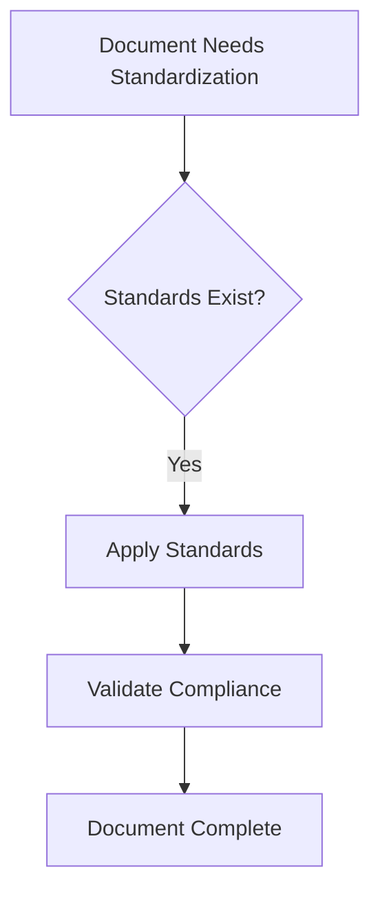
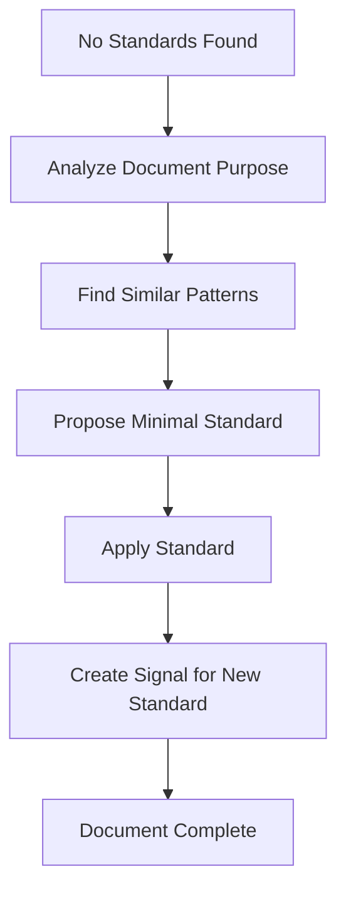

# **Analysis: Document Standardization and Integration Workflow v0**

## **1. Executive Summary**

This analysis establishes a systematic workflow for bringing unstructured content into the Company OS's structured documentation system. It addresses the common scenario where new concepts, thoughts, or mental models are introduced informally and need to be properly integrated with appropriate naming conventions, formatting standards, and structural placement—even when specific document types or standards don't yet exist.

**Key Outcome**: A repeatable process that ensures all documents in the system maintain consistency while allowing for evolution and emergence of new patterns.

## **2. Task Context**

### **2.1 The Problem**

When developing complex systems like Company OS, content often emerges in various forms:
- Exploratory analysis documents without proper structure
- New document types that don't fit existing categories
- Files created in rapid prototyping that lack standard formatting
- Content that bridges multiple archetypes or introduces new concepts

Without a systematic approach, this leads to:
- Inconsistent documentation quality
- Difficulty in navigation and discovery
- Broken automation and validation tools
- Knowledge silos and implicit understanding

### **2.2 The Opportunity**

By establishing a clear workflow for document standardization, we:
- Enable rapid creation while maintaining quality
- Capture emergent patterns for system evolution
- Provide clear guidance for both humans and AI agents
- Build a self-improving documentation system

## **3. Methodology: How to Reason About Document Standardization**

### **3.1 Core Principles**

1. **Explicit Over Implicit**: All formatting rules and standards must be discoverable
2. **Evolution Over Perfection**: Start with v0 and improve based on usage
3. **Pattern Recognition**: Look for recurring structures to inform standards
4. **Context Preservation**: Never lose information during standardization

### **3.2 Mental Model: The Three Layers**

When approaching any document, consider three layers:

```
┌─────────────────────────────────┐
│        CONTENT LAYER            │  What the document says
├─────────────────────────────────┤
│       STRUCTURE LAYER           │  How it's organized
├─────────────────────────────────┤
│        SYSTEM LAYER             │  How it fits in the OS
└─────────────────────────────────┘
```

### **3.3 Decision Hierarchy**

When making standardization decisions, prioritize in this order:
1. **Existing Standards**: Always check for applicable rules first
2. **Adjacent Patterns**: Look at similar document types
3. **System Coherence**: Ensure it fits the overall architecture
4. **Future Flexibility**: Don't over-constrain emerging patterns

## **4. Decision Framework**

### **4.1 When Standards Exist**



### **4.2 When Standards Don't Exist**



### **4.3 Key Questions for Decision Making**

1. **Document Type**: What archetype does this most closely resemble?
2. **Audience**: Who will consume this document (humans, AI, both)?
3. **Lifecycle**: Is this temporary or permanent documentation?
4. **Dependencies**: What other documents does this relate to?
5. **Evolution**: How might this document type evolve?

## **5. v0 Workflow: Document Standardization Process**

### **Workflow: Standardize Unstructured Documents**

#### **Process 1: Discovery and Assessment**

##### **Task 1.1: Identify Documents Needing Standardization**
- [ ] List all documents from source (e.g., git commit, directory scan)
- [ ] Quick scan each document for existing structure
- [ ] Categorize as: Compliant, Needs Update, or Unknown Type

##### **Task 1.2: Gather Existing Standards**
- [ ] Review knowledge-system.rules.md for documentation rules
- [ ] Check for document-type-specific rules (e.g., charter rules, brief rules)
- [ ] Identify the file naming convention pattern
- [ ] Note any gaps in standards coverage

#### **Process 2: Analysis and Planning**

##### **Task 2.1: Analyze Non-Compliant Documents**
- [ ] For each non-compliant document:
  - [ ] Identify what standards are violated
  - [ ] Determine if content matches file type
  - [ ] Check if frontmatter exists and is complete
  - [ ] Verify naming convention compliance

##### **Task 2.2: Handle Unknown Document Types**
- [ ] For each unknown type:
  - [ ] Analyze document purpose and content
  - [ ] Find most similar existing type
  - [ ] Propose minimal viable standard
  - [ ] Document reasoning for future reference

#### **Process 3: Implementation**

##### **Task 3.1: Apply Standard Formatting**
- [ ] For each document requiring updates:
  - [ ] Add/update frontmatter with all required fields
  - [ ] Ensure proper markdown structure (headers, sections)
  - [ ] Update file name if needed
  - [ ] Preserve all original content

##### **Task 3.2: Create Tracking Documentation**
- [ ] Document all changes made
- [ ] Note any new standards proposed
- [ ] Create signals for systematic improvements
- [ ] Update this workflow based on learnings

#### **Process 4: Validation and Integration**

##### **Task 4.1: Validate Standardized Documents**
- [ ] Run validation tools if available
- [ ] Manual review of formatting
- [ ] Check all links and references
- [ ] Ensure no content was lost

##### **Task 4.2: Integrate and Communicate**
- [ ] Commit standardized documents
- [ ] Update any indexes or navigation
- [ ] Create signals for new standards needed
- [ ] Share learnings with team

## **6. Case Study: Standardizing Last Commit Files**

### **6.1 Files Identified**

From git commit HEAD:
```
company_os/domains/charters/data/apn.charter.md
company_os/domains/paradigms/README.md
company_os/domains/paradigms/data/system-archetypes.paradigm.md
company_os/domains/principles/README.md
company_os/domains/principles/data/dual-flow.principle.md
work/domains/analysis/data/system-primitives.analysis.md
work/domains/briefs/data/BRIEF-2025-07-17-001-human-agentic-workflow-brief-apn.brief.md
```

### **6.2 Assessment Results**

| File | Status | Issues Found |
|------|--------|--------------|
| apn.charter.md | ✅ Compliant | None |
| paradigms/README.md | ✅ Compliant | None |
| system-archetypes.paradigm.md | ✅ Compliant | None |
| principles/README.md | ✅ Compliant | None |
| dual-flow.principle.md | ✅ Compliant | None |
| system-primitives.analysis.md | ❌ Non-compliant | Missing frontmatter |
| BRIEF-2025-07-17-001...brief.md | ✅ Compliant | None |

### **6.3 New Document Types Discovered**

1. **`.paradigm.md`** - Deep conceptual models
   - Status: Has examples, pattern is clear
   - Action: Document the standard

2. **`.principle.md`** - Detailed principle explanations
   - Status: Has examples, pattern is clear
   - Action: Document the standard

3. **`.analysis.md`** - Analytical documents
   - Status: No clear pattern yet
   - Action: Propose minimal standard based on this document

## **7. Tracking Log**

### **7.1 Issues Found**

| Issue ID | File | Issue Description | Resolution | Status |
|----------|------|-------------------|------------|--------|
| STD-001 | system-primitives.analysis.md | Missing frontmatter | Add standard frontmatter | Pending |
| STD-002 | All .analysis.md files | No documented standard | Create analysis.rules.md | Pending |
| STD-003 | New document types | .paradigm, .principle, .analysis not in rules | Update knowledge-system.rules.md | Pending |

### **7.2 Proposed Standards**

#### **Standard for `.analysis.md` files**

```yaml
---
title: "Analysis: [Descriptive Title]"
version: 1.0
status: "Draft|Active|Superseded"
owner: "[Team or Individual]"
last_updated: "YYYY-MM-DDTHH:MM:SS-TZ:00"
parent_charter: "[relevant charter]"
tags: ["analysis", "relevant", "tags"]
---
```

Purpose: Analytical documents that explore problems, propose solutions, or synthesize information for decision-making.

## **8. Patterns & Data Points**

### **8.1 Emerging Patterns**

1. **Frontmatter Consistency**: All formal documents use the same core fields
2. **Title Conventions**: "Type: Description" format (e.g., "Analysis: ...", "Principle: ...")
3. **README Patterns**: Directory READMEs explain the directory's purpose and contents
4. **Version Starting Point**: New documents typically start at version 1.0
5. **Status Progression**: Draft → Active → Deprecated/Superseded

### **8.2 Data Points for Refinement**

- **Time to Standardize**: ~10 minutes per document with clear standards
- **Most Common Issues**: Missing frontmatter (60%), incorrect naming (30%), unclear type (10%)
- **New Types Frequency**: Approximately 1 new document type per major feature
- **Automation Potential**: 80% of issues could be auto-fixed with proper tooling

### **8.3 Signals for Improvement**

1. Need for `.analysis.md` standard documentation
2. Automation opportunity for frontmatter generation
3. Pattern validation tools would catch 90% of issues
4. README standards could be more explicit

## **9. Future Evolution**

### **9.1 v1 Workflow Improvements**

1. **Automation**: Build tools to auto-detect and fix common issues
2. **Templates**: Create document templates for each type
3. **Validation**: Integrate with pre-commit hooks
4. **Discovery**: Better tools for finding undocumented patterns

### **9.2 System Integration**

1. **Rules Service**: Extend to handle all document types
2. **Signal Generation**: Automatic signals for standardization issues
3. **Documentation Graph**: Link standardization to knowledge architecture
4. **Continuous Learning**: Feed patterns back into rules

### **9.3 Success Metrics**

- **Compliance Rate**: % of documents meeting standards
- **Time to Integrate**: Average time from creation to compliance
- **Pattern Emergence**: Number of new patterns documented
- **Automation Coverage**: % of issues auto-fixed

## **10. Conclusion**

This workflow provides a systematic approach to bringing order to documentation chaos while preserving the flexibility needed for system evolution. By following this process, we ensure that the Company OS knowledge system remains both structured and adaptive.

The key insight is that standardization is not about rigid enforcement but about making implicit patterns explicit, enabling both human and AI agents to work more effectively within the system.

---

*Next Steps*:
1. Apply this workflow to standardize `system-primitives.analysis.md`
2. Create signals for the missing standards identified
3. Update knowledge-system.rules.md with new document types
4. Continue refining this workflow based on usage
